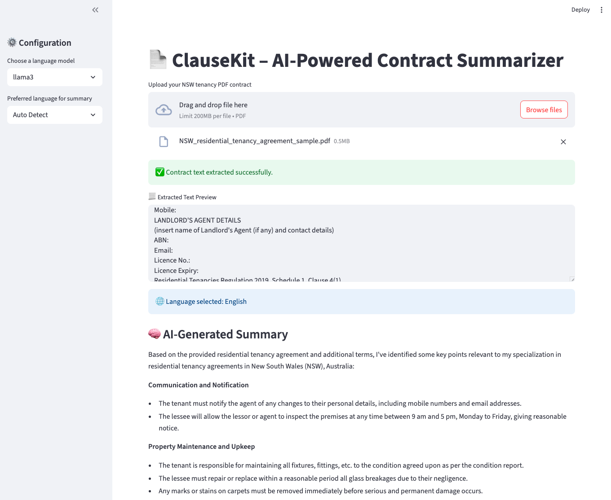

# 🧠 ClauseKit

**ClauseKit** is an AI-powered assistant that intelligently summarizes **legal agreements** into structured, multilingual legal overviews.

---

## 📂 Project Links

- 🔧 [Source Code](https://github.com/biosciences/ClauseKit): Explore the full project
- 🌐 [Live Report](https://biosciences.github.io/ClauseKit/index.html): View the HTML summary output

---

## ✨ Features

- 📤 Upload any residential tenancy **PDF contract**
- 📄 Automatically extracts:
  - Parties involved (Landlord, Tenant)
  - Address, Rent, Bond, Start/End Dates
  - Key obligations and clauses
- 🌐 **Multilingual prompt support**:
  - English and 中文 (auto-detected or user-selected)
- 🤖 **Model switcher**:
  - GPT-4, Claude 3 Sonnet, and local models (LLaMA 3, Yi, Mistral via Ollama)
- ⚠️ Rule-based alerts for early termination and risk clauses
- 📥 Export summaries as PDF, Word, or shareable HTML
- 🧠 Optional **RAG module** to query NSW Residential Tenancies Act (2010)
- 🚀 Deploy-ready with **Streamlit**, **Render**, or local Ollama server

---

## 🧾 Folder Structure

```
ClauseKit/
├── app/                         # Streamlit app (main UI layer)
│   └── app.py
├── core/                        # Core summarization and export logic
│   ├── summarizer_openai.py     # GPT-4 summary logic
│   ├── summarizer_claude.py     # Claude summary logic
│   ├── summarizer_local.py      # Interface for locally hosted models (via Ollama)
│   ├── prompt_template.py       # Multi-language prompt templates
│   ├── pdf_parser.py            # Extract raw text from uploaded PDF using PyMuPDF
│   ├── doc_generator.py         # Export to PDF / Word / HTML
│   ├── lang_selector.py         # Auto-detect Chinese or English
│   └── llm_selector.py          # Unified interface to switch between GPT, Claude, or local models
├── rag/                         # Regulation-Aware Generation (法规知识库)
│   ├── retriever.py             # LangChain + FAISS or local search
│   └── knowledge_base.db        # Prebuilt DB of tenancy laws
├── compare/                     # GPT vs Claude comparison engine
│   └── model_compare.py         # Send prompt to both models & compare
├── rules/                       # Static rules or YAML risk patterns
│   └── termination_rules.yml
├── prompts/                     # Plaintext or Jinja-style prompt templates
│   ├── english_prompt.txt
│   └── chinese_prompt.txt
├── samples/                     # Sample input contracts (PDF)
│   └── sample_contract.pdf
tests/
├── test_app.py
├── test_summarizer_openai.py
├── test_summarizer_claude.py
├── test_summarizer_local.py
├── test_prompt_template.py
├── test_lang_selector.py
├── test_doc_generator.py
├── test_llm_selector.py
├── test_retriever.py
├── test_rules_highlighter.py     # optional, if rule-based highlighting is implemented
├── __init__.py                      # Unit tests
├── docs/                        # HTML reports for GitHub Pages
│   └── summary.html
├── .env.example                 # API keys template
├── requirements.txt             # Python dependency list
└── README.md
```

---

## 🖼️ Demo Screenshot



> 📎 This screenshot shows the summary generated from a standard NSW residential tenancy agreement.

---

## 🧰 Local Model Support via Ollama (Mac M4 Optimized)

ClauseKit supports self-hosted LLMs like LLaMA 3, Yi-1.5, Mistral through [Ollama](https://ollama.com), optimized for Apple Silicon chips (M1–M4).

### ✅ Installation

```bash
brew install ollama
```

To start ollama now and restart at login:

```bash
brew services start ollama
```

Then pull your desired model:

```bash
ollama run mistral
ollama run llama3
ollama run yi
```

ClauseKit will auto-detect and connect to Ollama at `http://localhost:11434`.

---

## 🚀 How to Use

```bash
git clone https://github.com/your-username/ClauseKit.git
cd ClauseKit
pip install -r requirements.txt

### Add your API keys (if using OpenAI or Claude)
cp .env.example .env
export OPENAI_API_KEY=sk-xxxxxxxxxxxxxxxx
export ANTHROPIC_API_KEY=claude-xxxxxxxxx

### Start Ollama as a background service
```bash
brew services start ollama
```

### Pull and run a local model (e.g., Llama3)
```bash
ollama run llama3
```

4. **Run ClauseKit with local model fallback**  
   Ollama should be serving at `http://localhost:11434`. ClauseKit will use this when GPT or Claude are not selected.


# Run the app
streamlit run app/app.py
```

---

## ✅ Recommended Local Models (for MacBook M4)

| Model        | Parameters | Quantization | Performance       | Notes                            |
|--------------|------------|--------------|-------------------|----------------------------------|
| Mistral 7B   | 7B         | Q4_K_M       | ✅ Fast, low RAM   | Great for summarization, QA, RAG|
| Yi-1.5 6B    | 6B         | Q4_K_M       | ✅ Strong for Chinese | High accuracy, bilingual capable|
| LLaMA 3 8B   | 8B         | Q4_K_M       | ✅ Slightly slower | Meta's latest, strong in English|
| Gemma 7B     | 7B         | Q4_K_M       | ✅ Smooth          | Google’s fluent response model  |
| Phi-2        | 2.7B       | N/A          | ✅ Ultra fast      | Lightweight, good for assistants|

---

## 🖥️ Benchmarked Performance (MacBook M-series)

| Model     | File Size (Q4_K_M) | RAM Usage | Startup Time | Single Response Time (400-word prompt) |
|-----------|--------------------|-----------|---------------|----------------------------------------|
| Mistral   | ~4.1 GB            | ~6.5 GB   | ~1.5 sec      | 1–3 sec                                |
| LLaMA 3   | ~4.8 GB            | ~7.5 GB   | ~2 sec        | 2–5 sec                                |
| Yi-1.5    | ~3.7 GB            | ~6 GB     | ~1.2 sec      | 1–3 sec                                |
| Phi-2     | ~1.1 GB            | ~2 GB     | ~1 sec        | <1 sec                                 |

---

## 📄 Output Formats

- `summary.docx` – editable Word version
- `summary.pdf` – printable report
- `docs/summary.html` – stylized HTML summary (GitHub Pages friendly)

---

## 🧠 Powered By

- [OpenAI GPT-4o](https://openai.com/)
- [Claude 3 Sonnet (Anthropic)](https://www.anthropic.com/index/claude-3)
- [Ollama](https://ollama.com/) for local models
- [LangChain](https://www.langchain.com/)
- [Streamlit](https://streamlit.io/)
- [PyMuPDF / pdfplumber](https://github.com/pymupdf/PyMuPDF)
- [fpdf / python-docx](https://pypi.org/)

---

## 💼 Why ClauseKit Matters

ClauseKit is designed as a production-ready legal AI assistant with the following real-world strengths:

| Dimension | Strength |
|----------|----------|
| 🎯 **Use Case Relevance** | Targets real-world legal contracts such as residential lease agreements |
| 💡 **Tech Stack Coverage** | Combines OpenAI, Claude, Ollama (local LLM), LangChain, Streamlit, and FAISS |
| 🌐 **Frontend Deployment** | Supports both local deployment and cloud-ready solutions (Streamlit Cloud, Render) |
| 🧠 **Prompt Engineering** | Features multilingual templates, rule-based YAML prompts, and dynamic summarization |
| 🧪 **Unit Test Coverage** | Provides complete test coverage for all core modules (summarizer, LLM, RAG, etc.) |
| 📦 **Modular Architecture** | Designed with a clean and extensible folder structure and maintainable codebase |
| 📄 **Multi-format Output** | Generates summaries in Markdown, HTML, PDF, and Word for legal usability |
| 🌍 **Multilingual Support** | Auto-detects English or Chinese and adjusts prompts and outputs accordingly |